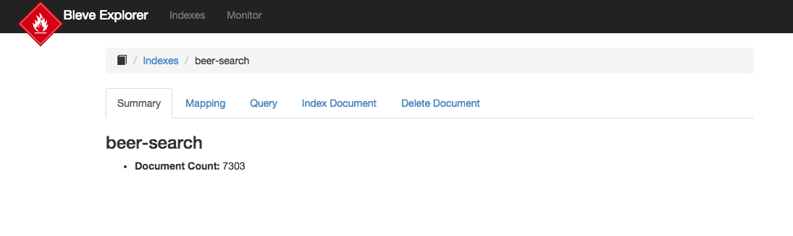
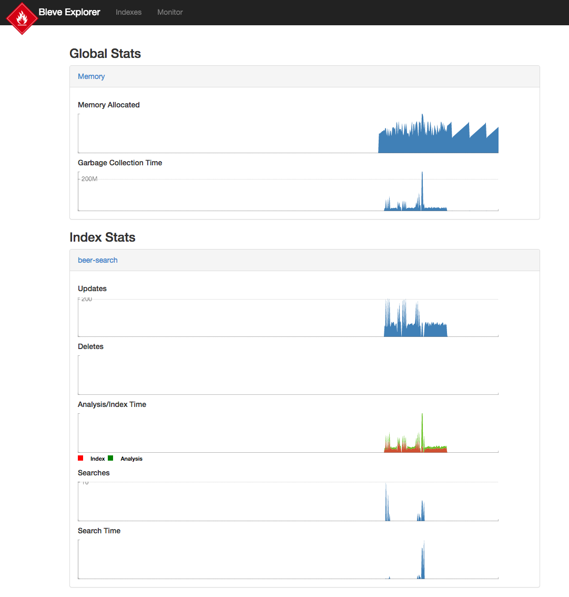

# bleve-explorer

An example app providing an HTTP/REST/JSON front-end to bleve.  It provides a REST API and an HTML interface to:

* create/list/delete indexes
* view index document count
* view index mapping
* index/delete documents
* query indexes
* monitor system performance

Watch a [video introduction](https://www.youtube.com/watch?v=DfbRTXE5n4Y) to bleve-explorer.

## Building

```bash
go build -tags full
```

The `-tags full` is optional, but includes all the optional components of bleve.

## Running

```bash
mkdir data
./bleve-explorer
```

This will use the default "data" dir for storing indexes.  Once started you can access the web UI at <http://localhost:8095/>.

## REST API

Bleve explorer uses the handlers provided by the  bleve.http package.  The handlers are attached to the following URLs:

* PUT /api/{indexName} - create new index
* GET /api/{indexName} - get index details
* DELETE /api/{indexName} - delete index
* GET /api - list indexes
* PUT /api/{indexName}/{docID} - index document
* GET /api/{indexName}/_count - count documents in index
* GET /api/{indexName}/{docID} - return stored fields of document
* DELETE /api/{indexName}/{docID} - delete document
* POST /api/{indexName}/_search - search index
* GET /api/{indexName}/_fields - list fields used by documents in index
* GET /api/{indexName}/{docID}/_debug - return rows in index related to document

## Script to load documents

In the [video introduction](https://www.youtube.com/watch?v=DfbRTXE5n4Y) to bleve-explorer I ran a script to load a directory of JSON documents.  Here is that script:

```bash
#!/bin/bash

for JsonFile in  *.json
do
    curl -X PUT http://localhost:8095/api/beer-search/$JsonFile -d @$JsonFile
done
```

## Screenshots

Tabs showing operations available on an index



The monitoring capabilities

